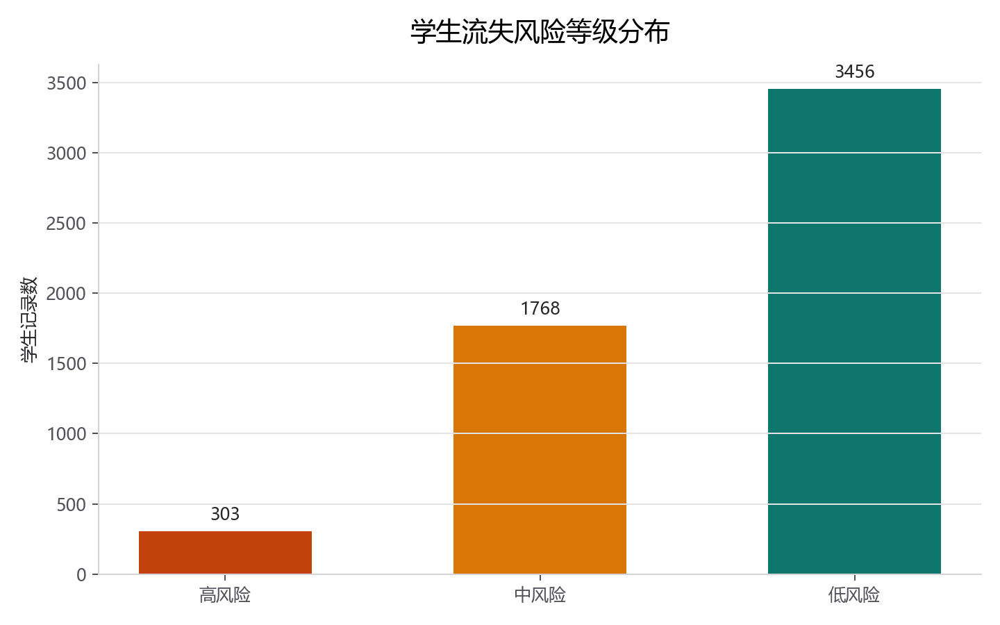
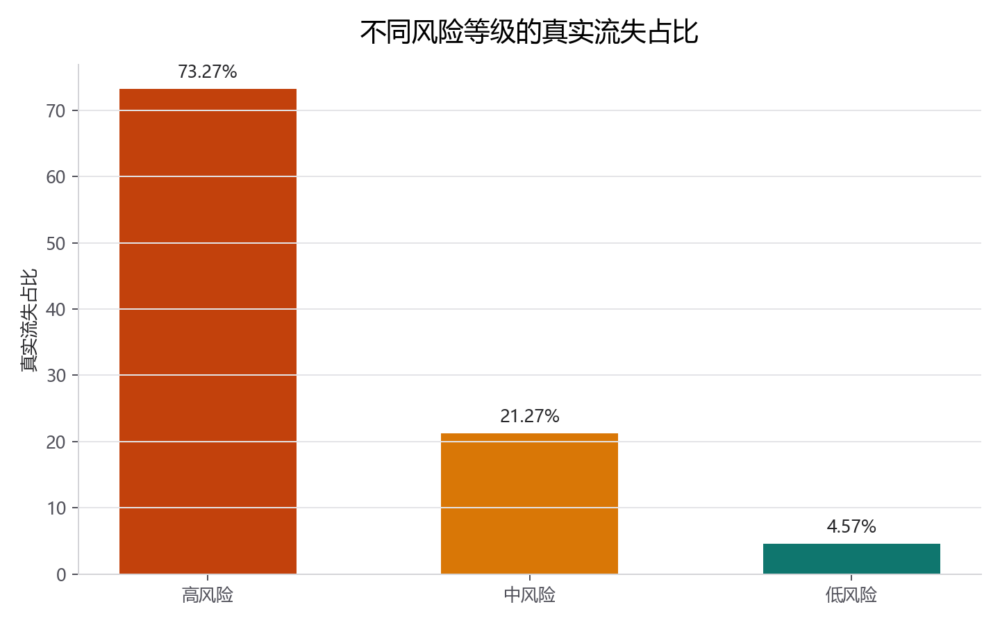
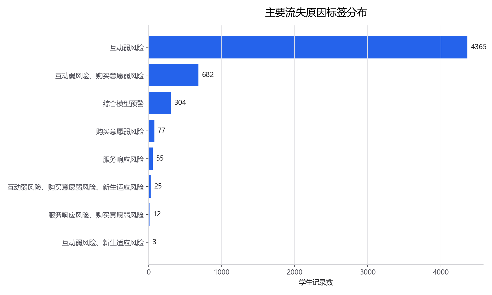
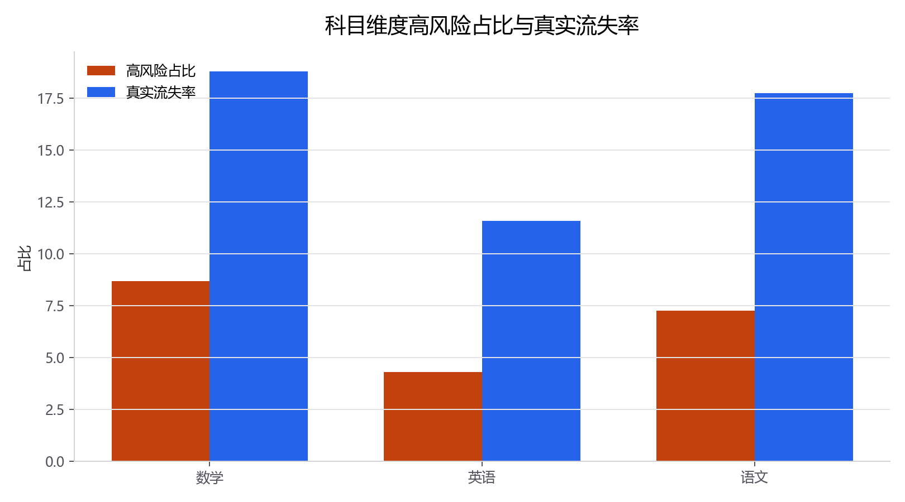
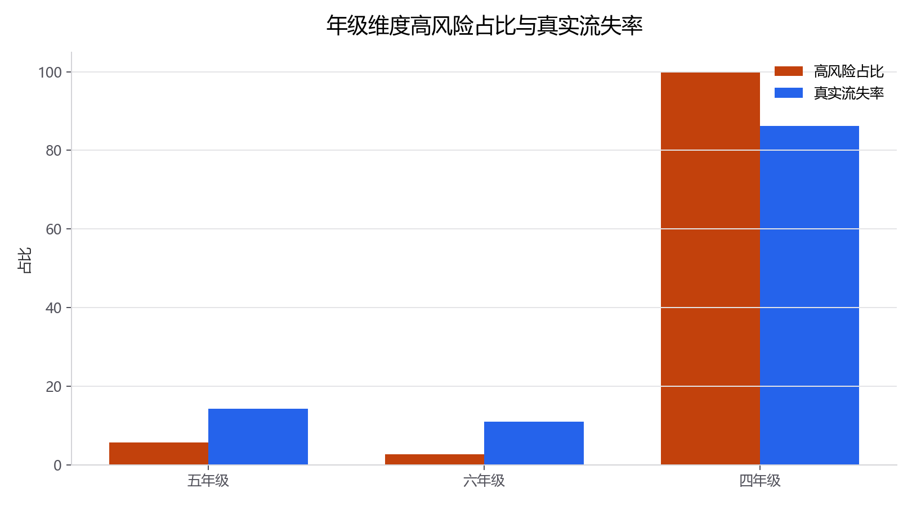
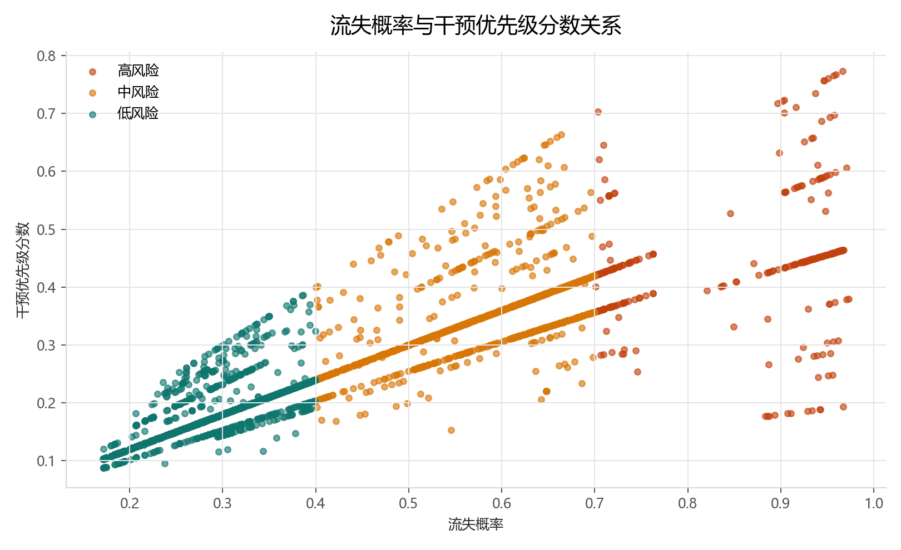

# 学生流失预警与干预分析

## 项目来源

数据来源为学生花名册类业务数据，字段覆盖班级、科目、年级、互动、续读状态等信息。由于原始明细包含学员编码和业务敏感字段，本发布版不公开原始 Excel、完整学生明细和 Top50 学生名单，仅保留聚合结果表、图表、SQL 与分析代码。

| 项目项 | 内容 |
|---|---|
| 数据主题 | 学生续读与流失风险 |
| 样本量 | 5,527 |
| 流失样本数 | 756 |
| 整体流失率 | 13.68% |
| 输出形式 | 风险等级、原因标签、建议动作、聚合图表 |

## 项目背景

教育机构需要提前识别下季度可能不再续读的学生，并将有限运营资源优先投入高风险、可挽回、价值较高的学生。本项目将“下季度是否继续在读”转化为二分类问题，并在模型输出后进一步生成可执行的风险等级和运营建议。

## 分析思路

1. 读取学生花名册数据，明确目标变量：下季度是否继续在读。
2. 清理结果型字段和可能造成数据泄露的字段。
3. 使用随机森林输出流失概率，并划分高、中、低风险等级。
4. 构建原因标签，解释风险来源，如互动弱、购买意愿弱、服务响应风险。
5. 设计干预优先级分数：流失概率 × 可挽回系数 × 学员价值系数。
6. 输出聚合结果表和展示图表，不公开学生个人明细。

## 操作过程

### Python

```bash
python src/新东方学生流失预警模型.py
python src/新东方学生流失预警与干预分析.py
```

如需复现完整流程，需要在项目根目录放置同结构的 `原始学生花名册.xlsx`。公开仓库默认只展示聚合结果。

### SQL

核心 SQL 位于 [`sql/核心分析SQL.sql`](sql/核心分析SQL.sql)，用于说明风险分布、命中率、科目/年级维度统计的查询口径。

### Jupyter

Notebook 位于 [`notebooks/新东方学生流失预警与干预分析.ipynb`](notebooks/新东方学生流失预警与干预分析.ipynb)，用于展示建模思路和结果图表。

## 模型与风险结果

| 指标 | 数值 | 说明 |
|---|---:|---|
| 样本量 | 5,527 | 参与建模和输出预警的学生记录数 |
| 流失样本数 | 756 | 下季度常规是否在读=否 |
| 流失率 | 13.68% | 流失样本占总样本比例 |
| Accuracy | 0.7055 | 整体预测准确率 |
| Precision | 0.2820 | 预警为流失的人中真实流失的比例 |
| Recall | 0.7460 | 真实流失学生中被识别出来的比例 |
| AUC | 0.8031 | 模型区分能力 |

### 风险等级分布

| 风险等级 | 人数 | 占比 |
|---|---:|---:|
| 高风险 | 303 | 5.48% |
| 中风险 | 1,768 | 31.99% |
| 低风险 | 3,456 | 62.53% |

### 风险等级命中情况

| 风险等级 | 合计 | 真实流失数 | 真实未流失数 | 真实流失占比 |
|---|---:|---:|---:|---:|
| 高风险 | 303 | 222 | 81 | 73.27% |
| 中风险 | 1,768 | 376 | 1,392 | 21.27% |
| 低风险 | 3,456 | 158 | 3,298 | 4.57% |

## 图表展示













## 主要结论

- 高风险学生占整体样本 5.48%，适合作为优先运营关注人群。
- 高风险名单真实流失占比为 73.27%，明显高于整体流失率 13.68%，风险等级具备区分度。
- 风险来源主要集中在互动弱风险，说明互动频率和反馈质量是关键运营信号。
- 干预优先级不只看流失概率，还要结合可挽回空间和学生价值，避免平均用力。

